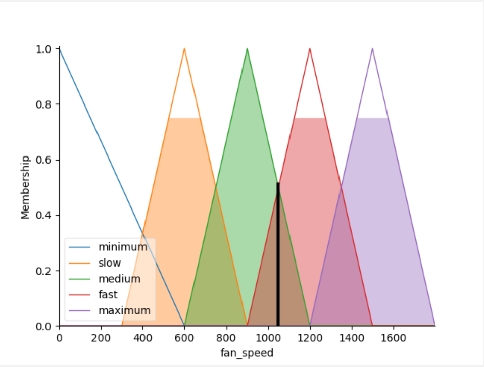
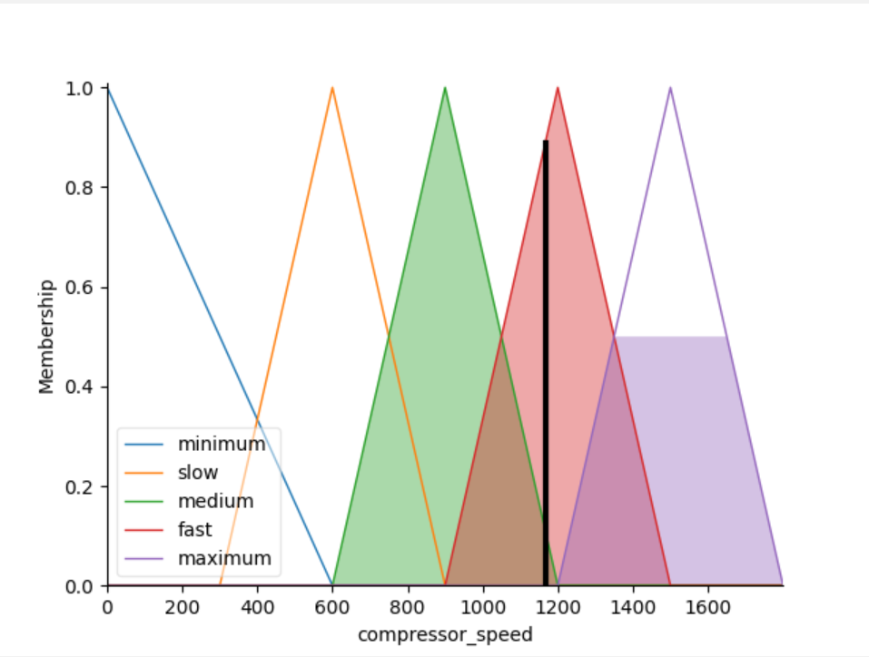

# Fuzzy Logic AC Controller

The proposed method controls air-conditioner fan and compressor motor speed smartly according to room temperature and
expected temperature, humidity and oxygen level.

# Getting Started

Please clone the repo at first

```
git clone https://github.com/mdmamunhasan/fuzzy-logic-ac-controller.git
cd fuzzy-logic-ac-controller
```

Please install python libraries

```
pip install -r requirements.txt
```

Please start execution

```
python main.py
```

## Console Output

```
Enter room temperature:30
Enter target temperature:25
Enter humidity:40
Press Enter For Processing Rules
Press Enter to View Fan Speed
Fan Speed 1046.9374106196394 RPM
Press Enter to View Compressor Speed
Compressor Speed 1166.6651045228907 RPM
Press any key to exit!
```




# Reference:

- https://ieeexplore.ieee.org/document/7784388
